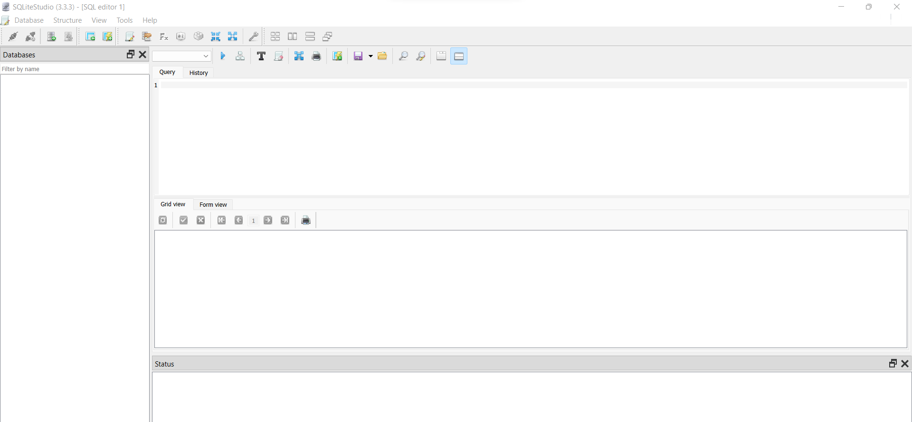
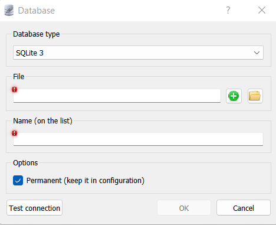
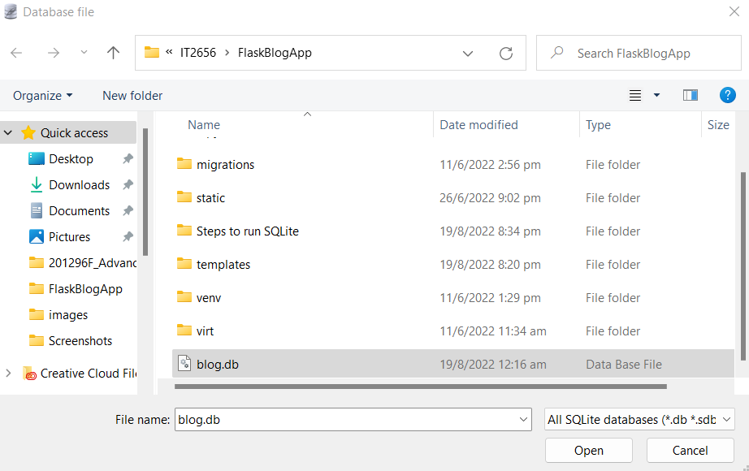
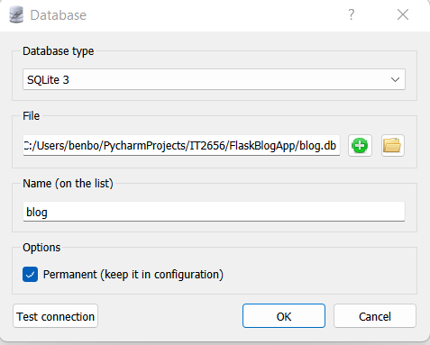
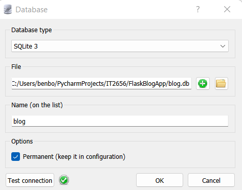
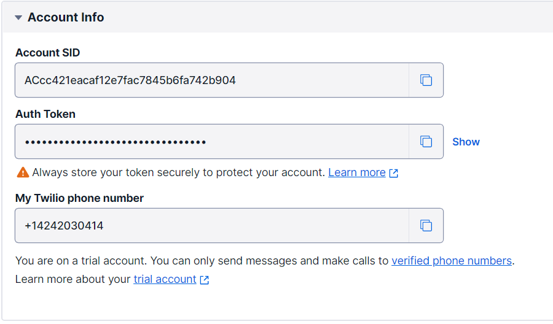
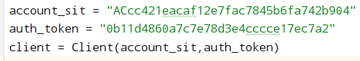
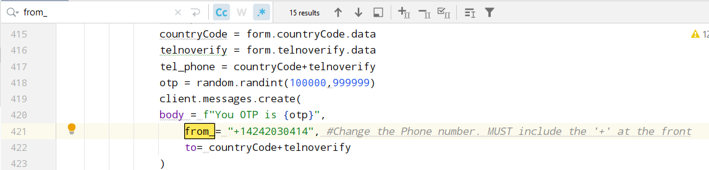

# IT2656 System Security Project

## Group Details

**PEM Group:** CS2103  
**Group Name:** FlaskerBlog 

**Team members:**
- [212064R]  Terence Kua **(Leader)**
- [201296F]  Surya Moorthy S/O Sathia Moorthy **(Integrator)**
- [211935B]  Lim Chee Yong
- [212627G]  Aidan Joseph

## Project Description

Our web application is a blog website that allows users to blog about their lives.

**Python Version:** 3.8 and above required.

Install requirements using: `pip3 install -r requirements.txt`

## Task Allocation

**Terence Kua Tat Wang**
- Data Protection
- Session Timeout
- Anti-CSRF Token
- Input Validation

**Surya Moorthy**
- Google and Github Login
- Password hash using Argon2
- Password Policy and Password Stats (Password Complexity)
- Security Questions
- Multi-factor Authentication (Email and SMS)
- Alert Messages

**Lim Chee Yong**
- ReCAPTCHA

**Aidan Joseph**
- Account Lockout
- Audit Log

## How to run this program
This web application uses SQLite db and therefore, you would either need to convert it to MySQL or, download SQLite.

Download SQLite here: https://sqlitestudio.pl/

**How to connect SQLite db**
1) Opening SQLite Studio

2) Connect to blog.db
    - At the top left conner, select Database
    - Click on Add a Database
   
    - Under the File field, select the file icon
    - In the pop-up screen, select the path of where blog.db is kept
      
    - Click Open
      
    - Click on Test connection
      
    - Click Ok
    - The db should have been added. You can expand the db to show all the tables as well as data.

**Connecting to a Twilio Account**

In order to test out the SMS OTP feature, you would need a Twilio account as well as the Configuration keys.

1) Sign up for Twilio
    - You can use this link to sign up for Twilio:
    https://www.twilio.com/try-twilio
    - This Twilio service is for SMS.

2) Navigate to your Console
    - You should be able to get a Phone Number and other required configurations.
   
    - Copy your Account SID and Auth Token and paste it in app.py
   
    - Change the phone number by searching through this program 'from_' in app.py
    
